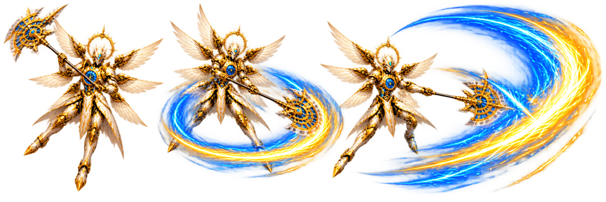
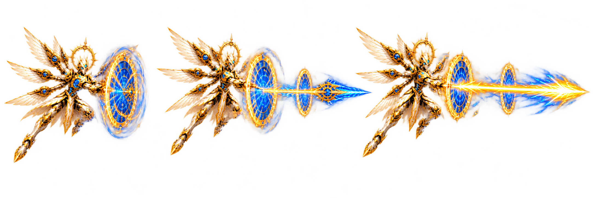
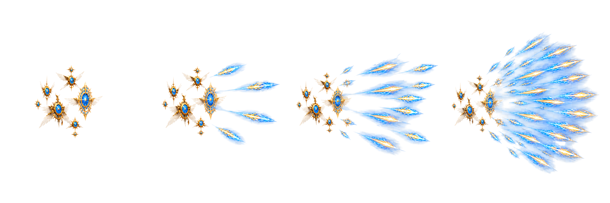
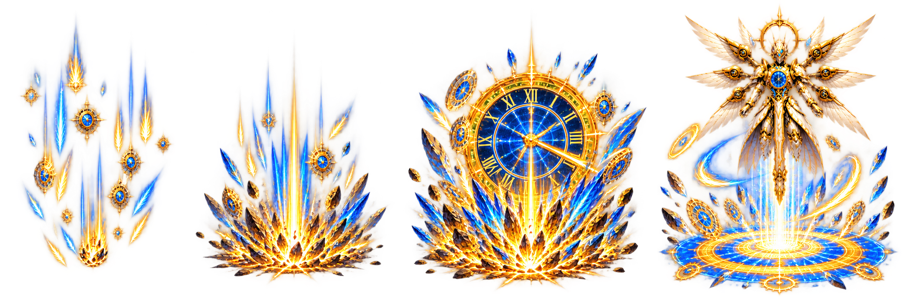

# Aurelius Attack Gallery

These are the high-resolution transparent strips currently used by the game. Each image is a complete animation sequence rather than an arbitrary square crop.

## Chrono Halberd Sweep

Three-frame close-range melee sequence.

## Portal Lance

Three-frame portal opening and lance volley.

## Feather Barrage

Four-frame clockwork drone and feather projectile barrage.

## Clockfall

Four-frame arena-area ultimate sequence.

